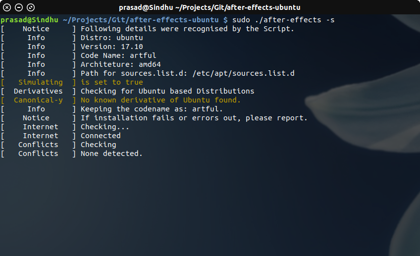
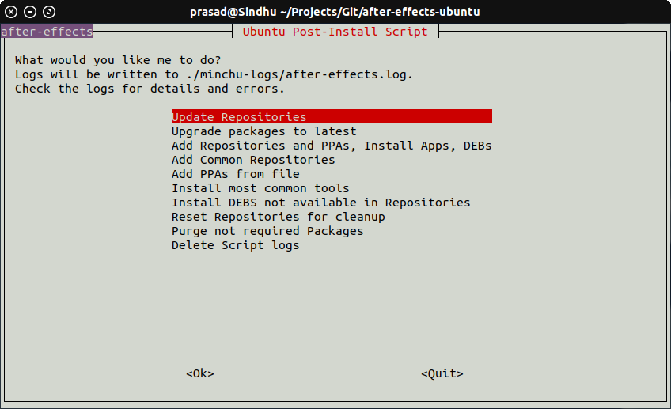

# After-Effects

<small>An effortless post install script for Ubuntu </small>

## Why

Upgrading a Linux machine comes with lot of headache. Somethings might break, somethings might not work or you might just want to
start fresh. Beauty of Linux is almost everything is scriptable. Re-installing is just a matter of putting your favorite distribution on USB, install and configuring it. If you do it often and over a fleet of machines, then its a pain. You can run a few scripts to automate it, but they are not so flexible. A package changed its name? PPA not available for the current release? You need to edit your script, test it and run it.

## How

What if your script could be "configured"? Just add the package you want to install to your config file. No need to search through code to do it. Separating your preferences and package lists from the script frees you from writing the script every time a new release comes around. This project helps you do just that. Its poor man's Chef. Most of your preferences and configurations are separate from script.

## Really? A shell-script

Yes! Because it has almost zero dependencies. No need to have Python or Ruby or other dependencies. Its simple and efficient. Someone can edit it to fit their needs too.

## How to

See [Getting Started](/getting-started.md).

## Screenshots

